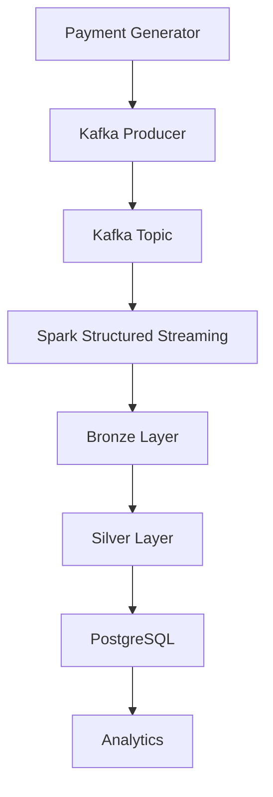

# Distributed Real-Time Payment Streaming Platform

Real-time payment streaming platform built using Apache Kafka, PySpark Structured Streaming, PostgreSQL, and Lakehouse architecture principles.

> Simulates a production-grade fintech payment processing pipeline with Bronze, Silver, and PostgreSQL serving layers.

---

## Architecture


---

## Features

- Real-time payment event generation
- Apache Kafka event streaming
- Spark Structured Streaming pipeline
- Bronze and Silver Lakehouse layers
- PostgreSQL serving layer
- Schema validation
- Data cleansing
- Parquet storage

## Tech Stack

## Tech Stack

| Layer | Technology |
|--------|------------|
| Language | Python |
| Streaming | Apache Kafka |
| Processing | PySpark Structured Streaming |
| Storage | Parquet |
| Database | PostgreSQL |
| Data Generation | Faker |
| Development | WSL2 Ubuntu |
| Version Control | Git |

---

## Project Structure

```text
distributed-payment-streaming-platform/

├── generator/
│   └── payment_generator.py
│
├── streaming/
│   └── payment_producer.py
│
├── spark/
│   └── payment_stream_processor.py
│
├── docker/
│   └── docker-compose.yml
│
├── data/
│
├── docs/
│
├── screenshots/
│
├── venv/          (Windows Virtual Environment)
├── wsl_venv/      (WSL Virtual Environment)
│
├── requirements.txt
└── README.md
```

---

# Current Pipeline Implementation

## Step 1: Start Kafka Broker (Windows CMD)

Open Command Prompt.

Navigate to Kafka installation:

```cmd
cd E:\kafka\kafka_2.13-3.8.1
```

Start Kafka Broker:

```cmd
bin\windows\kafka-server-start.bat config\kraft\server.properties
```

Expected Output:

```text
Kafka Server started
Awaiting socket connections on 0.0.0.0:9092
```

Keep this terminal running.

---

## Step 2: Start Payment Generator (Windows Git Bash)

Open Git Bash.

Navigate to project:

```bash
cd /e/DE/distributed-payment-streaming-platform
```

Activate Windows virtual environment:

```bash
source venv/Scripts/activate
```

Run generator:

```bash
python generator/payment_generator.py
```

Expected Output:

```text
Sent to Kafka
Sent to Kafka
Sent to Kafka
...
```

This continuously generates synthetic payment transactions and publishes them to Kafka.

Keep this terminal running.

---

## Step 3: Start Spark Structured Streaming (WSL Ubuntu)

Open VS Code using WSL Ubuntu.

Navigate to project:

```bash
cd /mnt/e/DE/distributed-payment-streaming-platform
```

Activate WSL virtual environment:

```bash
source wsl_venv/bin/activate
```

Run Spark Streaming job:

```bash
python spark/payment_stream_processor.py
```

Expected Output:

```text
Creating Kafka stream...
Kafka stream created
Starting stream query...
Stream query started
Query active: True
```

Spark subscribes to the Kafka topic and processes payment events in real time.

---

## Current Working Data Flow

```text
Payment Generator
↓

Kafka Producer

↓

Kafka Topic

↓

Spark Streaming

↓

Bronze

↓

Silver

↓

PostgreSQL

↓

Analytics
```

---

## Current Status

## Completed

- [x] Kafka Producer
- [x] Kafka Topic
- [x] Spark Streaming
- [x] Bronze Layer
- [x] Silver Layer
- [x] PostgreSQL Integration

## In Progress

- [ ] Gold Layer
- [ ] Data Quality Engine

## Planned

- [ ] MCP Server
- [ ] AI Operations Copilot
- [ ] Airflow
- [ ] Docker

---
# Future Architecture
```text
Payment Generator

↓

Kafka

↓

Spark

↓

Bronze

↓

Silver

↓

Gold

↓

PostgreSQL

↓

MCP Server

↓

AI Operations Copilot
```
---

## Goal

This project simulates a real-world financial event processing platform used in modern banking and payment infrastructure.

The objective is to demonstrate end-to-end Data Engineering concepts including event streaming, distributed processing, data lake architecture, workflow orchestration, and cloud integration.
